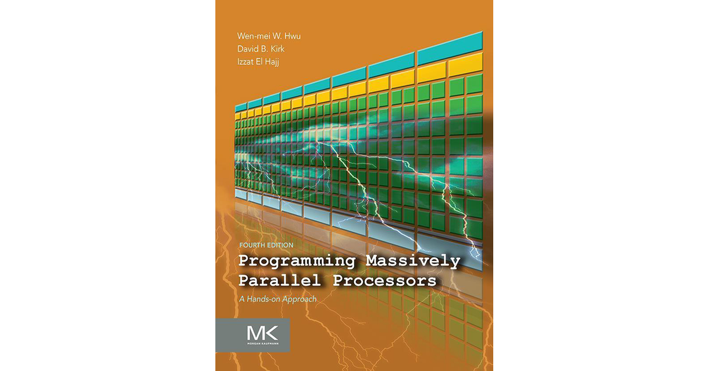

# 🚀 PMPP-Exercises: Solutions to *Programming Massively Parallel Processors*

This repository contains my solutions and implementations for the exercises in the book **Programming Massively Parallel Processors** by *Wen-mei W. Hwu, David B. Kirk, and Izzat El Hajj*.

### 📖 Reading Progress: Chapter 5 / 23

<progress value="5" max="23"></progress>

### 📖 Reading Progress: **Chapter 5 / 23**

✅ Chapter 1 | ✅ Chapter 2 | ✅ Chapter 3 | ✅ Chapter 4 | 🔄 Chapter 5 | ⬜ Chapter 6 | ⬜ Chapter 7 | ... | ⬜ Chapter 23

## 📖 About the Book
*Programming Massively Parallel Processors (PMPP)* is a foundational book for learning GPU computing, CUDA programming, and massively parallel architectures. The exercises cover:
- GPU architecture and CUDA fundamentals
- Parallel patterns and optimization techniques
- Performance tuning and memory management
- Advanced topics like warp scheduling and cooperative groups

## 📂 Repository Structure
Each chapter has a separate folder containing:
- **Exercise solutions** (`.cu` source code files)
- **Explanations and notes** (`.md` or `README.md` in each folder)
- **Performance benchmarks** (if applicable)

